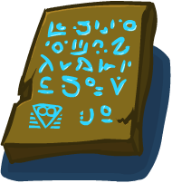

# An Urgent Appeal

Dear Colleague:

In 1967, during excavation for the construction of a new shopping
center in Monroeville, Pennsylvania, workers uncovered a vault
containing a cache of ancient scrolls.  Most were severely damaged,
but those that could be recovered confirmed the existence of a secret
society long suspected to have been active in the region around the
year 200 BC.

Based on a translation of these documents, we now know that the
society, the Cult of the Bound Variable, was devoted to the careful
study of computation, over two millennia before the invention of the
digital computer.

While the Monroeville scrolls make reference to computing machines
made of sandstone, most researchers believed this to be a poetic
metaphor and that the "computers" were in fact the initiates
themselves, carrying out the unimaginably tedious steps of their
computations with reed pens on parchment.  A few have conjectured a
city-sized machine powered by falling sand, but no physical evidence
of such a device has been discovered.

Among the documents found intact in the Monroeville collection was a
lengthy codex, written in no known language and inscribed with
superhuman precision.  It is believed to be the masterwork of the
Cult's scholarship, and as such it carries immense potential to
advance our understanding of history—and possibly of computing as
well.  Unfortunately, the codex eluded interpretation, and over the
decades, study of the Monroeville scrolls has slipped into obscurity.
Since 1978, the codex has been stored in the basement of the Carnegie
Museum of Natural History.

Two weeks ago, during a visit to the excavation site for a new
computer science building at CMU, workers discovered a set of
inscribed tablets that proved to be the Rosetta Stone for interpreting
the Monroeville codex.  The tablets precisely specify the Cult's
computing device, known to initiates as the "Universal Machine."
Although there is still no evidence that the cult succeeded in
constructing their machine, it is a reasonably simple task to emulate
it on modern hardware.

We can now say with certainty that the codex is in fact a program,
intended for execution on the Universal Machine.  Our initial
exploration of the codex suggests that the Cult's ideas about
programming were very sophisticated, if somewhat peculiar to the
modern eye.  One cannot help but wonder what the Cult might have
achieved had they had access to modern electronics and type theory.

I have enlisted the help of the CMU Principles of Programming group in
creating a venue for study of the codex.  We invite you to participate
in this investigation.  The codex and a translation of the Universal
Machine (UM) specification are available for download from our web
site.  We encourage you to implement the UM and begin your own
exploration of the codex.  When you are prompted to enter a decryption
key, type the following string: (\b.bb)(\v.vv)06FHPVboundvarHRAk

The Cult's scholarly publications are of particular interest to us.
Because the Cult's journals were circulated on sandstone tablets,
editors imposed very strict length limitations.  Consequently, authors
aggressively compressed their articles. A typical publication would
have the following form:

    PUZZL.TSK=100@1001|14370747643c6d2db0a40ecb4b0bb65

Publications are of varying value; some will represent a greater
contribution than others.  Given our understanding of the Cult's
publication process, we believe there is a mechanism within the codex
that will verify a set of publications and compute their total value.

On a personal note, being inspired by the scholarship of the Cult, I
have decided to dedicate the remainder of my days to a solitary study
of computation and programming languages.  However, before embarking
on my monastic transformation, I wish to see that the world is well on
its way to uncovering the secrets of the Codex.

Therefore, I ask that you submit as many publications as you can by
noon EDT on July 24, 2006, at which time I will be taking my orders.
My colleagues in the CMU POP group assure me that at that time, the
teams that have made the greatest contribution to the effort shall be
identified for special recognition.

Good luck and thank you for your assistance.

Sincerely,

Professor Emeritus Harry Q. Bovik
Computational Archaeolinguistics Institute
Carnegie Mellon University

# Contest Materials

## UM Specification

    [um-spec.txt](um-spec.txt)

Specification for the Universal Machine. Text format.

## Codex

    [codex.umz](codex.umz) (VOLUME ID 9)

    MD5 hash          e328209bd65ade420371d7bd87b88e4f
    SHA-1 hash        088ac79d311db02d9823def598e48f2f8723e98a
    Decryption key    (\b.bb)(\v.vv)06FHPVboundvarHRAk

## SANDmark

    [sandmark.umz](sandmark.umz)

Benchmark for the Universal Machine. [Expected output.](sandmark-output.txt)

    MD5 hash    1c604d454de05d04afdabd2c63fb27fb
    SHA-1 hash  c2ee087aa661e81407fbcf0d9d7e503aff9b268e

## Reference Implementation

    [um.um](um.um) (1024 bytes)

CMU Reference implementation of the Universal Machine.

This implementation supports all UM programs, including uncompressed
.um files and self-decompressing .umz files.  To use this
implementation to run a UM binary called c.um, simply concatenate the
two files together:

    cat um.um c.um > cmu.um

The resulting binary can be run in any compliant universal machine
implementation, including itself.
